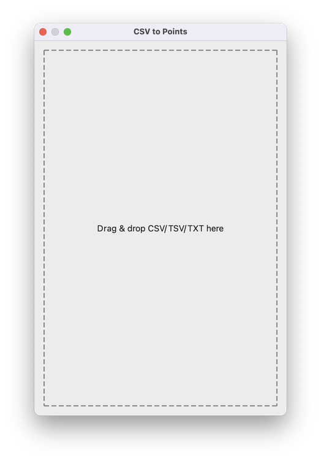
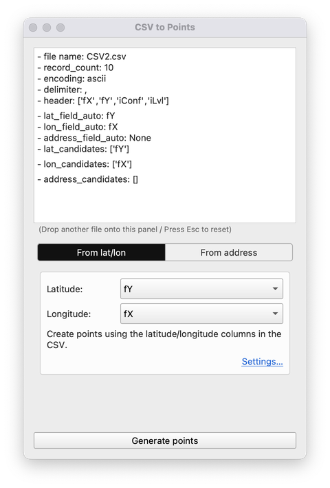
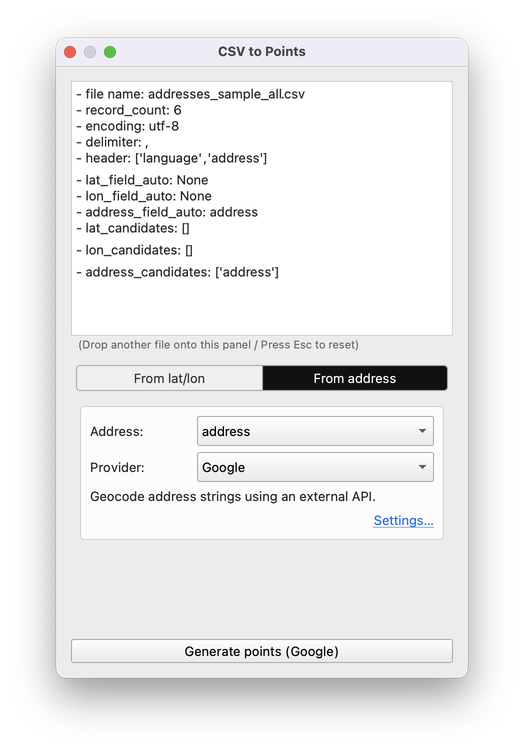
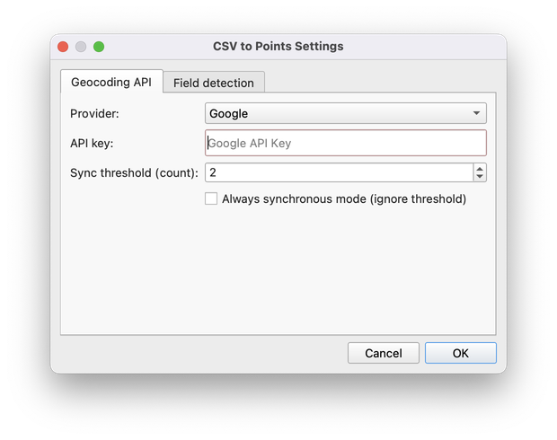
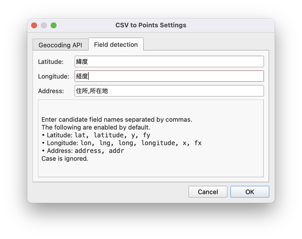

# CSV to Points
Create point layers from latitude/longitude or address fields by simply dragging and dropping a CSV file.

---

## Key features

- Drag a CSV into the plugin window. Latitude/longitude columns are auto-detected and you can create points with one click
- Geocoding is supported. If your file contains an address column, you can create points by geocoding the address
- The fields used for point creation (latitude, longitude, address) are auto-detected, and you can also choose them manually from combo boxes. The keywords used for auto-detection can be customized in Settings

---

## Installation

1. Launch QGIS and open Plugins → Manage and Install Plugins  
2. Search for "CSV to Points" and install it  
3. Open Plugins → CSV to Points to launch the plugin

---

## Usage

### Main panel

When you launch the plugin, the plugin window appears as shown below.

You can drag and drop a CSV file into the plugin window. TSV and TXT formats are also supported.

After dropping a file, the top area shows the analysis results and the bottom area shows the settings for creating points.

**When the file contains latitude/longitude fields**

If the dropped file contains latitude and longitude fields, it looks like this:

The settings area shows selection menus for latitude and longitude fields.
Columns that appear to be latitude/longitude are auto-selected, but you can choose other columns if you prefer.

Common column names such as "lat", "lon", "x", and "y" are auto-detected.
If your columns aren’t detected automatically, add keywords in the Settings panel.

Click "Create points" to add a point layer.
It is added as an in-memory layer, so use right-click → Export to save it if needed.

**When the file contains an address field**

If the dropped file contains an address field, it looks like this:

The settings area shows a selection menu for the address field and a menu to choose the geocoding provider.
Geocoding converts an address string into latitude/longitude.
To perform geocoding, you need an API key (or token) for the selected provider.
You can register your key in the Settings panel.
Supported providers: Nominatim, Google, Mapbox, OpenCage, HERE, and Yahoo! JAPAN.

Common column names such as "address" and "addr" are auto-detected.
If your address column isn’t detected automatically, add keywords in the Settings panel.

Click "Create points" to add a point layer.
It is added as an in-memory layer, so use right-click → Export to save it if needed.

### Settings panel

Open it from the QGIS Plugins menu or via the "Settings…" link in the plugin window.
The Settings panel has two tabs: "Geocoding API" and "Field detection".

**Geocoding API tab**

Enter API keys per provider for geocoding.

The "Synchronous threshold (records)" controls when processing switches between synchronous and asynchronous.

If the record count is below or equal to the threshold, features are created in one go. Above the threshold, processing runs asynchronously with a progress bar and a cancel option.
For large files, asynchronous mode lets you keep working while geocoding runs in the background.

**Field detection tab**

Configure the keywords used to detect latitude/longitude/address columns.

Enter comma-separated keywords. Columns that contain these strings are treated as candidates for the corresponding field.
If your usual column names aren’t detected automatically, add them here.

Common English names (e.g., lat, lon, address) are preconfigured, so you usually don’t need to add them.
You can add more keywords as needed; some Japanese keywords are also preconfigured.

---

## Supported environment

- QGIS 3.22 or later

---

## License

GPL-3.0 License
