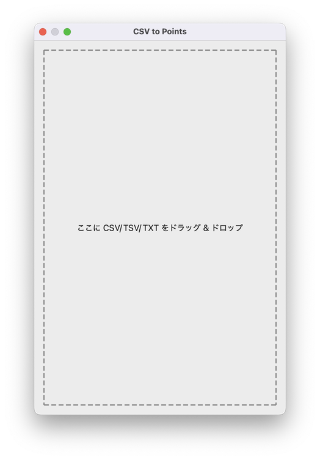
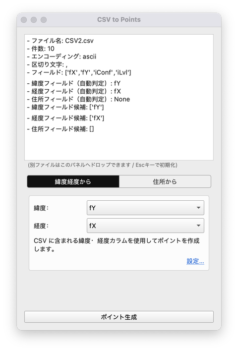
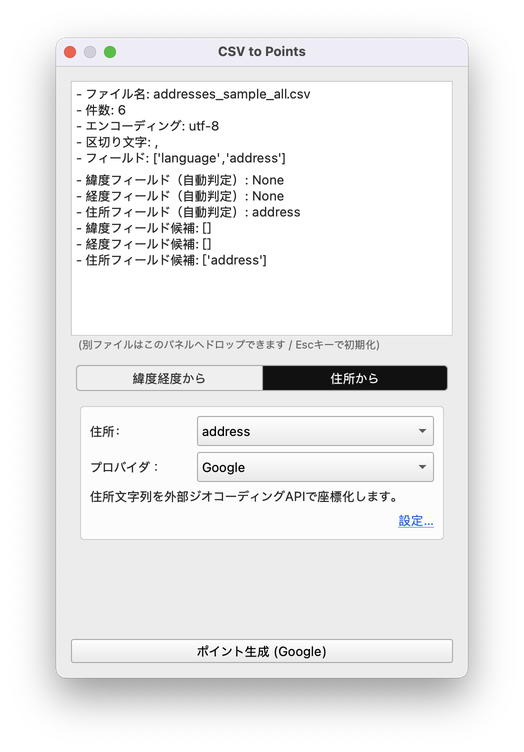
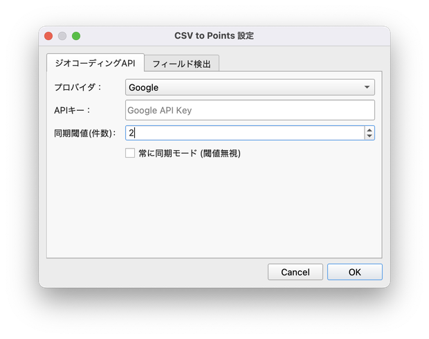
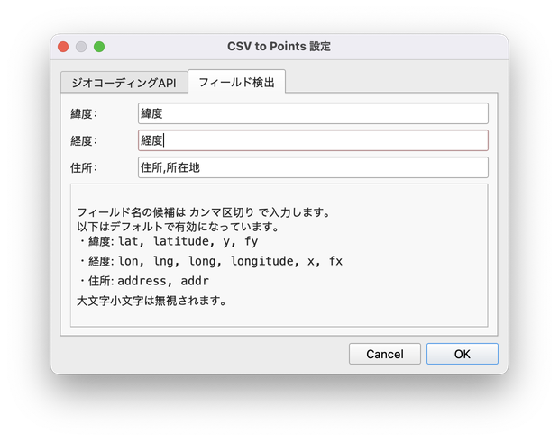

# CSV to Points
CSVファイルをドラッグ＆ドロップするだけで、緯度・経度や住所のフィールドから簡単にポイントレイヤーを生成できます。

---

## 主な機能

- プラグインウインドウにCSVをドラッグすると、緯度・経度のフィールドを自動認識し、ボタン一つでポイント化できます
- ジオコーディングにも対応。住所情報を含むフィールドがある場合は、住所からポイント化できます
- ポイント化に使うフィールド（緯度・経度・住所）は自動判定されますが、コンボボックスから手動で選択も可能です。自動判定に用いるキーワードは設定で追加できます

---

## インストール方法

1. QGISを起動し、[プラグイン] → [プラグインを管理とインストール] を開きます  
2. 「CSV to Points」で検索し、インストールします  
3. [プラグイン] → 「CSV to Points」 を選択すると起動します

---

## 使い方

### メインパネル

このプラグインを起動すると、以下のようなプラグインウインドウが表示されます。

プラグインウインドウにCSVファイルをドラッグ＆ドロップできます。TSVやTXT形式にも対応しています。

CSVファイルをドラッグすると、ウインドウの表示が変わります。
ウインドウの上部に、ドラッグしたファイルの解析結果、下部にポイント化の設定項目が表示されます。

**【緯度・経度フィールドを含むファイルの場合】**

ドラッグしたファイルに緯度・経度のフィールドが含まれる場合、以下のようになります。

設定項目では、緯度と経度のフィールドの選択メニューが表示されます。
各フィールドは、緯度・経度と思われる列が自動で選択されますが、任意に他の列を選ぶことも可能です。

「lat」や「lon」、「x」や「y」など、一般的に緯度・経度が含まれると考えられる列は自動で認識されます。
緯度・経度の列があるのに自動認識されない場合は、設定パネルでキーワードを追加してください。

「ポイント生成」をクリックするとポイントレイヤーが追加されます。
メモリレイヤーとして追加されるため、必要に応じて右クリック → エクスポートから保存してください。

**【住所フィールドを含むファイルの場合】**

ドラッグしたファイルに住所のフィールドが含まれる場合、以下のようになります。

設定項目では、住所のフィールドの選択メニューと、ジオコーディングに利用するプロバイダの選択メニューが表示されます。
ジオコーディングは、住所の文字列から緯度経度を照合する技術です。
ジオコーディングを行うには、ジオコーディングのプロバイダのAPIキーが必要です。
設定パネルから、APIキーを登録できます。
現在APIキーを登録できるプロバイダは「Nominatim」「Google」「Mapbox」「OpenCage」「HERE」「Yahoo! JAPAN」です。

「address」や「addr」など、住所を示す一般的な列名は自動認識されます。
住所の列があるのに自動認識されない場合は、設定パネルでキーワードを追加してください。

「ポイント生成」をクリックするとポイントレイヤーが追加されます。
メモリレイヤーとして追加されるため、必要に応じて右クリック → エクスポートから保存してください。

### 設定パネル

QGISの「プラグイン」メニューから選択するか、プラグインウインドウ内の「設定…」リンクから設定パネルを開けます。
設定パネルには「ジオコーディングAPI」と「フィールド検出」タブがあります。

**【ジオコーディングAPIタブ】**

ジオコーディングに利用するプロバイダのAPIキーをプロバイダごとに入力できます。

同期閾値（件数）では、同期処理と非同期処理を切り替えるしきい値（件数）を設定できます。

この件数以下であれば一括でポイント化します。しきい値を超える場合は非同期処理となり、進捗バーが表示されキャンセルも可能になります。
件数の多いファイルをジオコーディングする場合は、非同期処理により処理中も他の作業を行えます。

**【フィールド検出タブ】**

緯度経度や住所のフィールドの判定に使うフィールド名を入力できます。

各入力欄にカンマ区切りでキーワードを入力すると、その文字列を含む列が該当フィールド候補として自動判定されます。
普段利用している列名が自動判定されない場合は、ここに追加してください。

なお、英語の一般的なフィールド名（latやlon,addressなど）はデフォルトで設定されており、ここに入力する必要はありません。
それ以外の文字列を自動判定に利用したい場合は、追記してください。
デフォルトでは、日本語の文字列がいくつか追加されています。

---

## 対応環境

- QGIS 3.22 以降

---

## License

GPL-3.0 ライセンス
